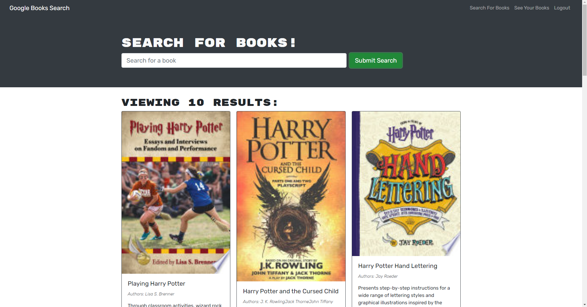

# book-search-engine

## license

## Description

This is a demonstration of using a mongoDB database as well as search api's to store and delete favorited books for a user.

## Tools Used

- HTML
- mongoDB
- JavaScript
- REACT

## Link

[https://youtu.be/Nqi_MzVmpoM](https://youtu.be/Nqi_MzVmpoM)

## Preview

## User Info

- [Github](https://github.com/gregmarz)
- [LinkedIn](https://www.linkedin.com/in/greg-marzec/)
